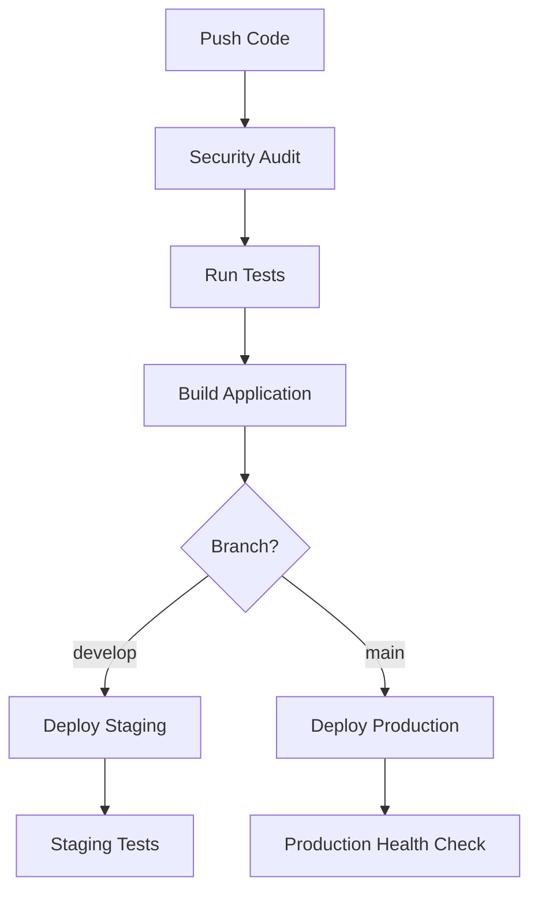

# Guide de Gestion des Secrets CI/CD - ALA Project

## 📋 Table des Matières / Table of Contents

1. [Introduction](#introduction)
2. [Bonnes Pratiques / Best Practices](#bonnes-pratiques--best-practices)
3. [Configuration des Secrets GitHub](#configuration-des-secrets-github)
4. [Variables d'Environnement](#variables-denvironnement)
5. [Pipeline CI/CD](#pipeline-cicd)
6. [Exemples Pratiques](#exemples-pratiques)
7. [Sécurité](#sécurité)
8. [Troubleshooting](#troubleshooting)

---

## Introduction

Ce guide explique comment gérer les secrets de manière sécurisée dans un pipeline CI/CD avec GitHub Actions. Les secrets incluent les mots de passe de base de données, clés API, tokens d'authentification, et autres informations sensibles.

**This guide explains how to securely manage secrets in a CI/CD pipeline with GitHub Actions. Secrets include database passwords, API keys, authentication tokens, and other sensitive information.**

---

## Bonnes Pratiques / Best Practices

### ✅ À Faire / DO

1. **Utiliser GitHub Secrets** pour stocker toutes les informations sensibles
2. **Séparer les environnements** (dev, staging, production) avec des secrets différents
3. **Principe du moindre privilège** - donner uniquement les accès nécessaires
4. **Rotation régulière** des secrets
5. **Chiffrement en transit et au repos**
6. **Audit et logging** des accès aux secrets
7. **Utiliser des variables d'environnement** plutôt que des fichiers de configuration

### ❌ À Éviter / DON'T

1. **Jamais hardcoder** les secrets dans le code source
2. **Jamais exposer** les secrets dans les logs
3. **Jamais committer** les fichiers `.env` contenant des secrets réels
4. **Jamais partager** les secrets via des canaux non sécurisés
5. **Jamais utiliser** les mêmes secrets entre environnements

---

## Configuration des Secrets GitHub

### Étape 1: Accéder aux Settings du Repository

1. Aller dans **Settings** → **Secrets and variables** → **Actions**
2. Cliquer sur **New repository secret**

### Étape 2: Créer les Secrets par Environnement

#### Secrets de Test
```
TEST_DB_PASSWORD=test_password_123
TEST_API_KEY=test_api_key_456
TEST_JWT_SECRET=test_jwt_secret_789
```

#### Secrets de Staging
```
STAGING_DB_PASSWORD=staging_secure_password
STAGING_API_KEY=staging_api_key
STAGING_JWT_SECRET=staging_jwt_secret
STAGING_DB_HOST=staging-db.example.com
```

#### Secrets de Production
```
PROD_DB_PASSWORD=super_secure_production_password
PROD_API_KEY=production_api_key
PROD_JWT_SECRET=production_jwt_secret
PROD_DB_HOST=prod-db.example.com
```

### Étape 3: Utilisation dans les Workflows

```yaml
env:
  DB_PASSWORD: ${{ secrets.PROD_DB_PASSWORD }}
  API_KEY: ${{ secrets.PROD_API_KEY }}
  JWT_SECRET: ${{ secrets.PROD_JWT_SECRET }}
```

---

## Variables d'Environnement

### Structure Recommandée

```bash
# Configuration de base
NODE_ENV=production
PORT=3000

# Base de données
DB_HOST=your-db-host
DB_NAME=your-db-name
DB_USER=your-db-user
DB_PASSWORD=your-secure-password  # ← SECRET

# API externe
API_ENDPOINT=https://api.example.com
API_KEY=your-api-key  # ← SECRET

# Authentification
JWT_SECRET=your-jwt-secret  # ← SECRET
SESSION_SECRET=your-session-secret  # ← SECRET
```

### Chargement Sécurisé

```javascript
const dotenv = require('dotenv');

// Charger les variables d'environnement
dotenv.config();

// Vérifier que les secrets sont chargés
const requiredSecrets = ['DB_PASSWORD', 'API_KEY', 'JWT_SECRET'];
const missingSecrets = requiredSecrets.filter(secret => !process.env[secret]);

if (missingSecrets.length > 0) {
    console.error('❌ Secrets manquants:', missingSecrets);
    process.exit(1);
}
```

---

## Pipeline CI/CD

### Architecture du Pipeline



### Jobs du Pipeline

1. **security-audit**: Scan des secrets hardcodés
2. **test**: Tests avec secrets de test
3. **build**: Construction de l'application
4. **deploy-staging**: Déploiement en staging
5. **deploy-production**: Déploiement en production

---

## Exemples Pratiques

### 1. Connexion Base de Données Sécurisée

```javascript
// ❌ MAUVAIS - Secret hardcodé
const dbConfig = {
    host: 'localhost',
    user: 'admin',
    password: 'password123', // DANGER!
    database: 'myapp'
};

// ✅ BON - Utilisation des variables d'environnement
const dbConfig = {
    host: process.env.DB_HOST,
    user: process.env.DB_USER,
    password: process.env.DB_PASSWORD,
    database: process.env.DB_NAME
};
```

### 2. Utilisation d'API avec Clés

```javascript
// ❌ MAUVAIS
const apiKey = 'sk-1234567890abcdef'; // Hardcodé!

// ✅ BON
const apiKey = process.env.API_KEY;
if (!apiKey) {
    throw new Error('API_KEY environment variable is required');
}
```

### 3. Logging Sécurisé

```javascript
// ❌ MAUVAIS - Expose les secrets
console.log('Config:', {
    dbPassword: process.env.DB_PASSWORD,
    apiKey: process.env.API_KEY
});

// ✅ BON - Masque les secrets
console.log('Config loaded:', {
    dbPasswordSet: !!process.env.DB_PASSWORD,
    apiKeySet: !!process.env.API_KEY
});
```

---

## Sécurité

### Audit des Secrets

```bash
# Rechercher des secrets potentiels dans le code
grep -r -E "(password|secret|key|token)\s*=\s*['\"][^'\"]{8,}" . --exclude-dir=node_modules

# Vérifier les fichiers .env
ls -la | grep .env

# Audit npm
npm audit
```

### Rotation des Secrets

1. **Mensuelle** pour les secrets critiques
2. **Immédiatement** en cas de compromission
3. **Coordination** entre équipes pour éviter les interruptions

### Monitoring

- Surveiller les accès aux secrets
- Alertes sur les échecs d'authentification
- Logs d'audit centralisés

---

## Troubleshooting

### Problèmes Courants

#### 1. Secret non trouvé en CI/CD

```
Error: Environment variable API_KEY is not set
```

**Solution**: Vérifier que le secret est configuré dans GitHub Secrets avec le bon nom.

#### 2. Différences entre environnements

```
Database connection failed in production
```

**Solution**: Vérifier que les secrets de production sont différents de ceux de test.

#### 3. Pipeline échoue sur la branche

```
Warning: The `set-env` command is deprecated
```

**Solution**: Utiliser la nouvelle syntaxe GitHub Actions pour les variables d'environnement.

### Commandes de Diagnostic

```bash
# Vérifier les variables d'environnement (sans les exposer)
node -e "console.log('DB_PASSWORD set:', !!process.env.DB_PASSWORD)"

# Tester la connexion
curl -f http://localhost:3000/health

# Vérifier les secrets dans l'app
curl http://localhost:3000/api/status
```

---

## Ressources Supplémentaires

- [GitHub Secrets Documentation](https://docs.github.com/en/actions/security-guides/encrypted-secrets)
- [OWASP Secrets Management](https://owasp.org/www-community/vulnerabilities/Use_of_hard-coded_password)
- [Node.js Security Best Practices](https://nodejs.org/en/docs/guides/security/)

---

**🔒 Rappel Important**: Les secrets ne doivent jamais être exposés dans le code source, les logs, ou les réponses API. Utilisez toujours les mécanismes sécurisés fournis par votre plateforme CI/CD.